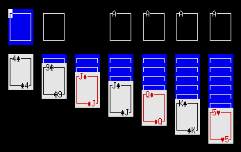
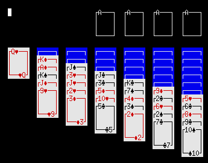
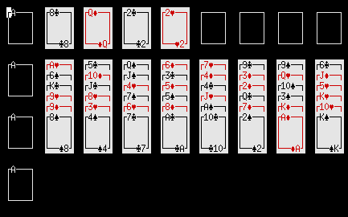
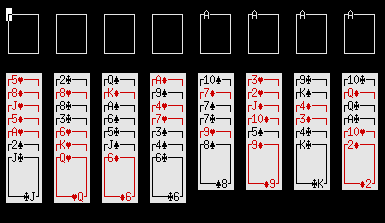
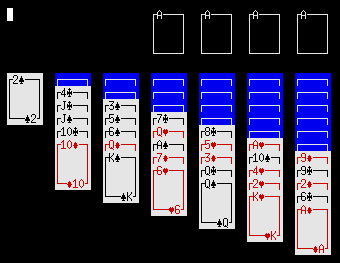
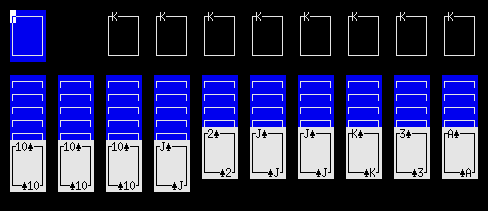
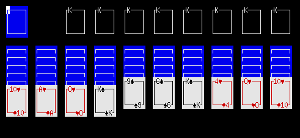
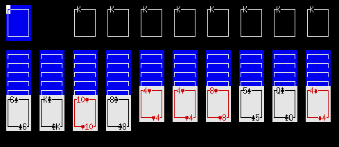
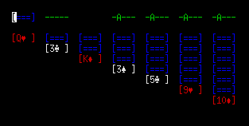
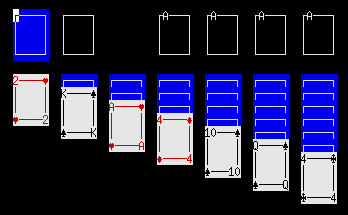

# csol

A small collection of solitaire games implemented in C using ncurses.


## Usage

Compile and run:
```
cmake .
make
./csol
```

## Games

Klondike (default): `csol klondike`



Yukon: `csol yukon`



Eight Off: `csol eightoff`



Freecell: `csol freecell`



Russian Solitaire: `csol russian`



Yukon Freecell: `csol yukonfc`


Klondike Freecell: `csol klondikefc`


Spider 1 Suit: `csol spider1`



Spider 2 Suits: `csol spider2`



Spider 4 Suits: `csol spider4`



Golf: `csol golf`


## Themes

`csol -t default`

`csol -t default-xl`


`csol -t ascii`


`csol -t compact`



`csol -t compact-ascii`


`csol -t ultracompact`


`csol -t corners`



## Options

* `--version`/`-v`: Show version
* `--help`/`-h`: Show help
* `--list`/`-l`: List games
* `--themes`/`-T`: List themes
* `--theme <name>`/`-t <name>`: Use a theme
* `--mono`/`-m`: Disable colors
* `--seed <seed>`/`-s <seed>`: Seed the prng
* `--config <file>`/`-c <file>`: Use a configuration file
* `--colors`/`-C`: List colors available in the current terminal
* `--scores`/`-S`: Show stats for all games.
* `--scores <game>`/`-S <game>`: Show history of all scores in a game.

## Keys

Move the cursor using <kbd>H</kbd>, <kbd>J</kbd>, <kbd>K</kbd>, and <kbd>L</kbd> or the arrow keys.

Move the cursor to the leftmost position using <kbd>Shift</kbd>+<kbd>H</kbd> or <kbd>Shift</kbd>+<kbd>←</kbd>.

Move the cursor to the rightmost position using <kbd>Shift</kbd>+<kbd>L</kbd> or <kbd>Shift</kbd>+<kbd>→</kbd>.

Move the cursor to the bottom of the current pile using <kbd>Shift</kbd>+<kbd>J</kbd> or <kbd>Shift</kbd>+<kbd>↓</kbd>.

Move the cursor to the top of the current pile using <kbd>Shift</kbd>+<kbd>K</kbd> or <kbd>Shift</kbd>+<kbd>↑</kbd>.

Select the card under the cursor using <kbd>Space</kbd>.

Move the selected card to the tableau or foundaton under the cursor using <kbd>M</kbd> or <kbd>Enter</kbd>.

If the card under the cursor is already selected, pressing <kbd>Space</kbd> again will move the card to a foundation or a free cell if possible.

Press <kbd>A</kbd> to automatically move a card (from any tableau or cell) to a foundation if possible.

Press <kbd>S</kbd> to move a card from the stock to the waste or redeal if stock is empty.

Press <kbd>W</kbd> to move a card from the waste to the pile under the cursor.

Press <kbd>1</kbd> &ndash; <kbd>9</kbd> to move a card from a cell to the tableau or foundation under cursor.

Press <kbd>U</kbd> or <kbd>Ctrl</kbd>+<kbd>Z</kbd> to undo one or more moves.

Press <kbd>Shift</kbd>+<kbd>U</kbd> or <kbd>Ctrl</kbd>+<kbd>Y</kbd> to redo.

Press <kbd>Esc</kbd> to clear the current selection.

Press <kbd>Ctrl</kbd>+<kbd>L</kbd> to redraw the screen.

Press <kbd>R</kbd> to play a new game.

Press <kbd>Q</kbd> to quit.

## Mouse

In terminals with mouse support it's possible to select cards using the left mouse button (same as <kbd>SPACE</kbd>) and to move cards using the right mouse button (same as <kbd>M</kbd>).

## Configuration

The system-wide configuration file is `/etc/xdg/csol/csolrc` with games in `/etc/xdg/csol/games` and themes in `/etc/xdg/csol/themes`.

csol will use `$XDG_CONFIG_HOME/csol/csolrc` or `$HOME/.config/csol/csolrc` instead if one of them exists. The `include`-command can be used to include the system-wide-configuration file. An example of a simple configuration file:

```
include /etc/xdg/csol/csolrc
default_game yukon
default_theme default-xl
scores 1
stats 1
scores_file scores.csv
stats_file stats.csv
smart_cursor 0
```

The `theme_dir` and `game_dir` commands can be used to lazily load theme and game configuration files from a directory.

The `scores` command enables or disables the use of CSV file to record all scores. `scores_file` can be used to set the file path of the scores file.

The `stats` command enables or disables the use of CSV file to keep track of total game time and the best scores for each game. `stats_file` can be used to set the file path of the stats file.

On Linux the default location for `scores.csv` and `stats.csv` is either `$XDG_DATA_HOME/csol/` or `$HOME/.local/share/csol/`. On DOS and Windows the default location is the same directory as `csol.exe`.

The `smart_cursor` command toggles an alternative cursor movement scheme that always places the cursor on a card.

### Themes

Themes are defined with the `theme`-command:

```
theme {
  name test
  title "Test theme"
  heart   ♥
  spade   ♠
  diamond ♦
  club    ♣
  width 6
  height 4
  x_spacing 2
  y_spacing 1
  x_margin 2
  y_margin 1
  color my_green 0 500 0
  bg my_green
  fg black
  empty {
    top    ┌────┐
    middle │    │
    bottom └────┘
    fg white
    bg my_green
  }
  back {
    top    ┌────┐
    middle │    │
    bottom └────┘
    fg white
    bg blue
  }
  red {
    top    ┌────┐
    middle │    │
    bottom └────┘
    fg red
    bg white
  }
  black {
    top    ┌────┐
    middle │    │
    bottom └────┘
    fg black
    bg white
  }
}
```

`heart`/`spade`/`diamond`/`club` are used to set the symbols used for the different suits.

`width`/`height` are used to set the size of a card.

`x_spacing`/`y_spacing` are used to set the horizontal/vertical spacing between cards.

`x_margin` sets the distance between the left side of the terminal and the first card.

`y_margin` sets the distance between the top of the terminal and the first card.

`rank` followed by a number between 1 and 13 and a symbol redefines the symbol used for a rank.

`utf8` can be set to 0 if the theme doesn't use UTF8 encoding.

`empty`/`back`/`red`/`black` are used to set the characters used to draw cells and the back and front of cards.

`text`-blocks can be placed inside layout-blocks (`empty`, `back` etc.) to add text:

```
text {
  format suit_rank
  x -1
  y -1
  align left
}
```

`format` is one of `suit_rank`, `rank_suit`, `rank`, `suit`, or `none` (default).

If `x` is negative, the x-position will be calculated as `width + x`.

If `y` is negative, the y-position will be calculated as `height + x`.

`align right` can be used to right align the printed text such that the right-most character is printed on `x`.

#### Colors

`fg` and `bg` are used to set the foreground and background colors used to draw the background and cards.
The two commands expect a color index or a color name. The colors assigned to each index depends on the terminal and color scheme of the terminal, but often the values 0&ndash;7 are assigned to black, red, green, yellow, blue, magenta, cyan and white and the values 8&ndash;15 are assigned to brighter versions of those colors.

The following named default colors are available: `default`, `black`, `blue`, `green`, `cyan`, `red`, `magenta`, `yellow`, `white`, `bright_black`, `bright_blue`, `bright_green`, `bright_cyan`, `bright_red`, `bright_magenta`, `bright_yellow`, and `bright_white`.

In some terminals it is also possible to redefine colors using the `color`-command. This command takes 4 arguments. The first arguments is either the index of a color to redefine or a name, the following three arguments are the red/green/blue values for the color in the range 0&ndash;1000.

### Games

Games are defined using the `game`-command:

```
game {
  name klondike
  title Klondike
  repeat 4 {
    foundation {
      x 3+
      first_rank a
      next_suit same
      next_rank up
    }
  }
  repeat 7 {
    tableau {
      y 1
      x 0+
      deal 1+
      hide -1
      first_rank k
      next_suit diff_color
      next_rank down
      move_group group
    }
  }
  stock {
    deal 52
  }
  waste {
    x 1
    from stock
  }
}
```

The command `decks` specified how many decks of cards are used in the game (default is 1).

The command `deck_suits` specifies which suits are used in a deck. The suits are identified by a letter, e.g. `deck_suits hs` matches hearts and spades.

There are four types of rule-blocks that can be used inside a `game`-block: `foundation`, `tableau`, `stock`, and `waste`.

The `repeat` command can be used to repeat a game rule. Inside a `repeat`-block it's possible to use expressions of the form `INIT+INCREMENT` where `INIT` is the value used for the first iteration. Before each additional iteration `INCREMENT` (optional, 1 by default) is added to the value.
The following example creates three cells with the (x, y) values (0, 2), (1, 4), and (2, 6):

```
repeat 3 {
  cell {
    x 0+
    y 2+2
  }
}
```

#### Game rules

The following command can be used in a rule block:

* `x`: horizontal position of the pile (default: 0).
* `y`: vertical position of the pile (default: 0).
* `deal`: number of cards to initially deal to the pile, `rest` can be used to deal remaining cards from deck (default: 0).
* `redeal`: maximum number of redeals (for `stock`-pile). -1 for unlimited (default -1).
* `hide`: number of cards to initially deal face-down. If the number is negative, i.e. `hide -n`, then all cards are hidden except the top n cards (default 0).
* `first_rank`: rank of first card in pile (see below for possible values) (default: `ace` if foundation, `none` if stock, `any` otherwise).
* `first_suit`: suit of first card in pile (see below for possible values) (default: `same` if foundation, `none` if stock, `any` otherwise).
* `next_rank`: rank of next card in pile (see below for possible values) (default: `up` if foundation, `down` if tableau, `none` if stock or cell, `any` otherwise).
* `next_suit`: suit of next card in pile (see below for possible values) (default: `same` if foundation, `any` if tableau, `none` if stock or cell, `any` otherwise).
* `move_group`: whether it's possible to move a valid sequence (`group`), a complete sequence (`all`), any sequence (`any`), or just single cards (`one`, default).
* `from`: which pile type to accept cards from: `foundation`, `cell`, `tableau`, `stock`, `waste`, `any`, or `none` (default: `stock` if waste, `any` otherwise).
* `to`: which pile type to move stock cards to (default: `waste` if stock, `any` otherwise.
* `win_rank`: the game is won when the top card of all foundations is of this rank (see below for possible values) (default: `king` if foundation, `none` otherwise).
* `class`: an integer. Can be used to group together several game rules (default: 0).
* `turn`: an integer. How many cards to turn from stock. (default: 1 if stock, 0 otherwise).
* `same_class`: a rule block that applies only when the class of the source and destination is the same.
* `valid_group`: a rule block that applies when moving sequences of cards.

The following values can be used with commands that expect a rank:

* `any`: any rank
* `none`: no cards allowed
* `empty`: empty pile expected (e.g. `win_rank empty`)
* `a`/`2`/`3`/`4`/`5`/`6`/`7`/`8`/`9`/`10`/`j`/`q`/`k`: exact rank
* `same`: must be the same rank as the card below
* `down`: must be exactly one rank lower than the card below
* `up`: must be exactly one rank higher than the card below
* `up_down`: must be exactly one rank higher or lower than the card below
* `lower`: must be lower rank than the card below
* `higher`: must be higher rank than the card below

The follwing values can be used with commands that expect a suit:

* `any`: any suit
* `none`: no cards allowed
* `heart`/`diamond`/`spade`/`club`: exact suit
* `red`/`black`: exact color
* `same`: must be the same suit as the card below
* `same_color`: must be the same color as the card below
* `diff`: must be a different suit than the card below
* `diff_color`: must be a different color than the card below
