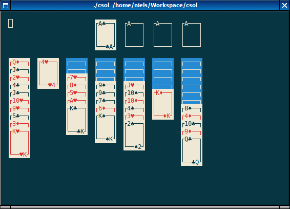
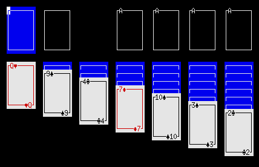
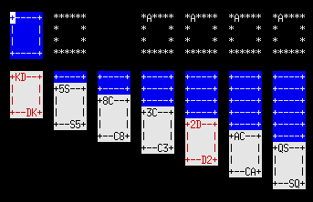

# csol

A small collection of solitaire games implemented in C using ncurses.



## Usage

Compile and run:
```
cmake .
make
./csol
```

## Games

Klondike (default): `csol klondike`


Yukon: `csol yukon`


Eight Off: `csol eightoff`


Freecell: `csol freecell`


Russian Solitaire: `csol russian`


## Themes

`csol -t default`

`csol -t default-xl`



`csol -t ascii`



## Options

* `--version`/`-v`: Show version
* `--help`/`-h`: Show help
* `--list`/`-l`: List games
* `--themes`/`-T`: List themes
* `--theme <name>`/`-t <name>`: Use a theme
* `--mono`/`-m`: Disable colors
* `--seed <seed>`/`-s <seed>`: Seed the pnrg
* `--config <file>`/`-c <file>`: Use a configuration file

## Configuration

The system-wide configuration file is `/etc/xdg/csol/csolrc` with games in `/etc/xdg/csol/games` and themes in `/etc/xdg/csol/themes`.

## Keys

Move the cursor using <kbd>H</kbd>, <kbd>J</kbd>, <kbd>K</kbd>, and <kbd>L</kbd> or the arrow keys.

Select the card under the cursor using <kbd>SPACE</kbd>.

Move the selected card to the tableau or foundaton under the cursor using <kbd>M</kbd>.

Press <kbd>A</kbd> to automatically move a card (from any tableau) to a foundation if possible.

Press <kbd>Q</kbd> to quit.
