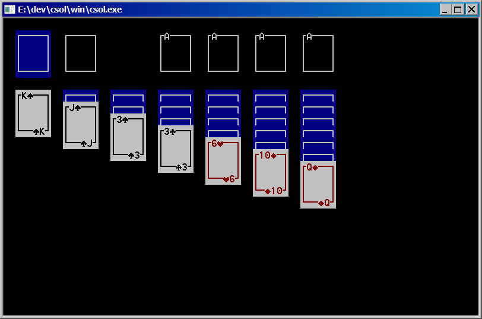

# csol for Windows

Can be compiled using:
- [MinGW](http://www.mingw.org/)
- [pdcurses](https://pdcurses.sourceforge.io/) (can be installed using the MinGW installer)

After installing MinGW and MSYS open a command prompt in the `win` subdirectory, then type `make` to produce `csol.exe`.
